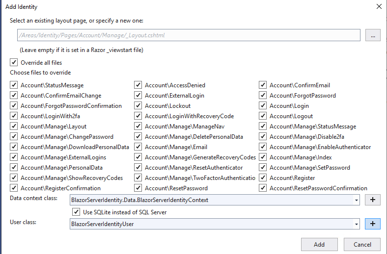

# BlazorServerIdentity
Project demonstrating scaffolding MS Identity into a Blazor Server project and converting the scaffolded pages to Blazor/Razor pages

The simplest form of Identity within Blazor Server is Individual User Accounts.  
However, resulting Registration and Login/Logout flows are unaccessible within a library.
Therefore this project will scaffold the same flows and then convert them into Blazor pages.

## Base00.00.00
Base version
* Create a new Blazor Server project in Visual Studio
* Named this project BlazorServerIdentity

## Base 01.00.00
### Scaffold Identity  
* Right click on he project, Add --> New Item


* Select the Identity Scaffold


* The Identity Override Dialog will appear


* I have checked
    * Override all files
    * Click on the Plus symbol to create a new Data Context, accepted the default
    * Clicked the check box on using SQLite
    * Click the Plus symbol for a new User class, accepted the default
    
    * Click Add button to begin the scaffolding.  This will take a few minutes
     
    * When completed the Scaffolding ReadMe.txt file will appear.

### Edit Startup.cs
Use _Scaffolding Readme.txt_ as a guide.  It is not 100% accurate, but very close.
>
* This step is already done
> 
* Technically, this can go anywhere within ```Configure()``` but I put it below ```app.UseRouting();```
* I usually add ```app.UseAuthorization()``` and this **MUST** go below ```app.UseRouting();```
* This final product look like:
> 

 
> 
* This is no longer necessary with the introduction of ```services.AddRazorPages```
* See https://docs.microsoft.com/en-us/aspnet/core/migration/22-to-30?view=aspnetcore-3.1&tabs=visual-studio for further details
> 
* This is already done as shown above
>   
* Add these two in atop the ```MapBlazorHub``` and ```MapFallbackToPage("/_Host);``` entry generated during project creation.
* This is what the final product looks like:
* 

### New Files
* The Scaffolding process created approximately 72 files in Areas/Identity.
  * This is where Pages for Register, Login, and Logout are located.
* To support these Pages, the new files were created in folder <ProjectName>/Pages/Shared for Layout and Login menu items
* The files *_ViewImports.cshtml* and *_ViewStart.cshtml*  were added to support the Asp.Net core Pages
* Once converted to Blazor, all these files can go away.
* *ProjectName.db* is the SqLite db file.  
* _Scaffolding Readme.txt_ are the post scaffolding instructions.

### Modified Files
* *appsettings.json* -- SqLite connection string added to it.
  * Because of SqLite's embedded nature, nothing really sensitive in the connection string.  
  * Optional to keep in *appsettings.json* or put in **User Secrets** 
* *ProjectName.csproj* --  Scaffolding process downloaded and injects almost a dozen libraries into project.
* *Startup.cs* -- Manually modified.

### Compile Project
* Make sure the project compiles first.  The following steps won't work if it doesn't.
#### RegisterConfirmation.cshtml Error
* ```The type or namespace name 'UserManager<>' could not be found```
* This is a scaffolding errror, but easy to fix.
* Go to *ProjectName.Areas.Identity.Pages.Account*
* Open _RegisterConfirmation.cshtml.cs__
* Add ```using Microsoft.AspNetCore.Identity;``` top section of file
* Save and Compile
* Fix any additional errors.

### Database Setup
* Follow the instructions in _Scaffolding Readme.txt_
```
Type 'get-help NuGet' to see all available NuGet commands.

PM> Add-Migration CreateIdentitySchema
Build started...
Build succeeded.
To undo this action, use Remove-Migration.
PM> Update-Database
Build started...
Build succeeded.
Done.
PM> 
```

### Test
A lot of mistakes can happen along the way, so it is important to test, take checkpoints and be sure everything is working before moving forward.


#### Registration Flow
* Launch the application
* The typical "Hello World" appears.
* Add ```Identity/Account/Login```  to the URL
* A screen like the following should appear
> * 
* Since no users exist in the database, you must first register one
* Select the **Register as a new user** link
> 
* Enter an account and password.  The Email address doesn't have to be real at this juncture.
* If successfully registered, a **Register Confirmation** screen will appear.  
> 

  * Because the system is not wired into an email system, confirmation step is a mock up.
    Click on the link to confirm the email address.
    * Internally, this updates the just registered account, setting ```IsEmailConfirmed = true```
    This is important because Authentication defaults to requiring confirmed email (which is also best practice).
    This and many other settings are adjustable in *Startup.cs* Authentication option *Need more here*
* After confirming the email, a findal **Confirm Email** screen appears.
> 
* This completes the Registration flow.  
* The pages used were *Register*, *RegisterConfirmation* and *ConfirmEmail*  These will be converted to Blazor.

#### Login / Logout Flow
* Click on the **Login** link highlighted in the picture above.
* Proceed to login with the email and password used earlier.
* You are returned to the *Hello World* page, with nothing new or different.
* Add ```Identity/Account/Login```  to the URL
* The page header should now be very different, with **Hello username** and **Logout** displayed
> 
* Clicking on **Hello username** will go to the Profile page, which is out of scope for this exercise.
* Clicking on **Logout** will logout the user.
> 
* This completes the Login / Logout flow
* The Login and Logout pages were used (duh)  This will also be modified for Blazor.
> Explore as you wish, and proceed when ready.


## Base 01.01.00 Blazor A&A aware 
Before jumping into making the flows Blazorized, need to make Blazor Authenticaion and Authorization aware.
* The guidance used in this project is at:
  * https://docs.microsoft.com/en-us/aspnet/core/security/blazor/?view=aspnetcore-3.1
  * See it for explanations of the steps to follow. 
* For guidance connecting to Azure Active Directory (AAD)
  * https://docs.microsoft.com/en-us/aspnet/core/security/blazor/server?view=aspnetcore-3.1&tabs=visual-studio
* For connecting with Azure Active Directory Business 2 Consumer (AADB2C)
  * https://docs.microsoft.com/en-us/azure/active-directory-b2c/

### Update our packages
This project created using 3.1.1 packages, even though the latest were 3.1.3.  
Update the packages using NuGet Manager.  Compile and retest.

### App.razor
* Wrap the Router in <CascadingAuthenticationState>
* Use an AuthorizeRouteView of the layout
```
<CascadingAuthenticationState>
    <Router AppAssembly="@typeof(Program).Assembly">
        <Found Context="routeData">
            <AuthorizeRouteView RouteData="@routeData" DefaultLayout="@typeof(MainLayout)" />
        </Found>
        <NotFound>
            <LayoutView Layout="@typeof(MainLayout)">
                <p>Sorry, there's nothing at this address.</p>
            </LayoutView>
        </NotFound>
    </Router>
</CascadingAuthenticationState>
```

### Shared/MainLayout.razor
* Add auth class next to top-row class
* Add element ```<LoginDisplay>``` in the top row div
```
@inherits LayoutComponentBase

<div class="sidebar">
    <NavMenu />
</div>

<div class="main">
    <div class="top-row px-4 auth">
        <LoginDisplay />
        <a href="https://docs.microsoft.com/aspnet/" target="_blank">About</a>
    </div>

    <div class="content px-4">
        @Body
    </div>
</div>
```

### Shared/LoginDisplay -- Create
In the Shared folder, create razor page LoginDisplay
```
<AuthorizeView>
    <Authorized>
        <a href="Identity/Account/Manage">Hello, @context.User.Identity.Name!</a>
        <form method="post" action="Identity/Account/LogOut">
            <button type="submit" class="nav-link btn btn-link">Log out</button>
        </form>
    </Authorized>
    <NotAuthorized>
        <a href="Identity/Account/Register">Register</a>
        <a href="Identity/Account/Login">Log in</a>
    </NotAuthorized>
</AuthorizeView>
```

* *App.razor* is the element name for the entire Blazor application.  
Wrapping it in ```<CascadingAuthenticationState>``` make authentication state informatio available to the entire application.
* *MainLayout.razor* inserts a LoginDisplay element into the top row of our UI.
* *LoginDisplay.razor* creates the top row menu for our UI on all pages. 
    * If you are authorized, it displays ```Hello username Logout```
    * If not authorized, it displays ```Register Log in```

### Compile and Test
User can now Register and Login on the Index screen.
>
* Once logged in, can see username and Logout links


### Conclusion
These 3 files make up the crucial pieces to make a Blazor Server app A&A aware.
However, the Registration and L&L flows are still Asp.Net Core pages.


## Base 02.00.00 Sign In and Sign Out
At this stage, converting the scaffolded pages to Blazor components is more or less a mechanical process.
**EXCEPT** actually executing the ```SignInManger.SignIn()``` and ```SignInManager.SignOut``` methods. 
They will throw an exception every time.
Remember SignInManager is not supported in Blazor. 
This project is about having 100% Blazor Server components implementing Identity. 
Calling the Login Page generated by scaffolding works but is anathema to this project. 
There are numerous, high quality technologies available for Production quality Identity. 
Again, this project seeks to have Identity in Blazor stood up as easily and effortlessly as an Asp.Net Core project does. 
While not quite out of the box as Asp.Net Core, and with contributions from a lot of people, here is a workable solution.

### Base 02.01.00 SignIn
NavigationManager is the recommended class for navigating between pages in Blazor.
It can also navigate to Razor Pages and other websites.  It is not an Request/Response paradigm.  More like a Redirect.
It also has the ```forceload``` option that when set to ```true```, to quote the documentation:
* Client-side routing is bypassed.
* The browser is forced to load the new page from the server, whether or not the URI is normally handled by the client-side router.
This forces the *browser* to load the page, and therefore go over HTTP instead of the Blazor cicuit. 
In turn, the Identity cookie from Login gets returned to the Blazor side, and Authentication is completed.  
This is how NavigationManager can succeed in using Razor Pages as remote methods.
As mention above, there are other, better ways to do this, but this is very quick and effective.

A downside is that NavigationManager can only do a GET.  So the Razor Pages will have be tweaked (some same kludged) to be made to work.
But for the goals of this project, that is acceptable.

#### Login.cshtml.cs
* Open *Areas/Identity/Pages/Account/Login.cshtml.cs*
* Add `using Microsoft.AspNetCore.WebUtilities;`
  * This library makes building Uris easier.
* Comment out the entire `OnGetAsync()` method
* Make a copy of the entire `OnPostAsync()` method
* Rename the copy to `OnGetAsync()`
  * NavigationManager can only do GETs, so we have to sacrifice the original.
* Modify the new `OnGetAsync()` to match the following:
```
        public async Task<IActionResult> OnGetAsync(string returnUrl, string email, string password, string rememberme)
        {
            returnUrl = returnUrl ?? Url.Content("~/");
            var query = new Dictionary<string, string>
            {
                { "isSuccessful", "true" },
                { "message", "Success" },
            };

            if (Input == null) Input = new InputModel() { Email = email, Password = password, RememberMe = Convert.ToBoolean(rememberme) };

            if (ModelState.IsValid)
            {
                // This doesn't count login failures towards account lockout
                // To enable password failures to trigger account lockout, set lockoutOnFailure: true
                var result = await _signInManager.PasswordSignInAsync(Input.Email, Input.Password, Input.RememberMe, lockoutOnFailure: false);
                if (result.Succeeded)
                {
                    _logger.LogInformation("User logged in.");
                    var retUrl = QueryHelpers.AddQueryString(returnUrl, query);

                    return LocalRedirect(retUrl);
                }
                if (result.RequiresTwoFactor)
                {
                    return RedirectToPage("./LoginWith2fa", new { ReturnUrl = returnUrl, RememberMe = Input.RememberMe });
                }
                if (result.IsLockedOut)
                {
                    _logger.LogWarning("User account locked out.");
                    return RedirectToPage("./Lockout");
                }
                else
                {
                    query["isSuccessful"] = "false";
                    query["message"] = "General Error";
                    _logger.LogInformation("Login unsuccessful, General Error");
                    var retUrl = QueryHelpers.AddQueryString(returnUrl, query);
                    return LocalRedirect(retUrl);
                }
            }

            // If we got this far, something failed, redisplay form
            query["isSuccessful"] = "false";
            query["message"] = "General Error";
            _logger.LogInformation("Login unsuccessful, General Error");
            var retUrl = QueryHelpers.AddQueryString(returnUrl, query);
            return LocalRedirect(retUrl);
        }
```
* The email address, password and rememberMe flag are passed as query parameters now.  
* Is this insecure, yeah.  Can it be improved, yes.  Is this good enough for solo dev, education, prototyping, yes.
* A new dictionary of parameters is set up as `query` and loaded with successful return values.
* `Input` is intialized with passed values.
* If the signin is successful, a return Url is created and LocalRedirect called.
  * This enables the new `Login.OnGetAsync()` to be called from any Blazor component
  * If the signin fails, a return url query parameters indicating failure is returned.  Likewise if there is some unknown error.
* *Login.cshtml* can be left untouched.
  
#### SignIn.razor
* Create *Areas/Identity/Pages/Account/SignIn.razor*
* It was created in this folder to keep it part of Identity.  This is a generic component related to Identity, so it should stay in that Area.
* *SignIn.razor* was originally constructed as 1:1 replacement of *Login.cshtml.cs* 
However, when it was learned that SignInManager does not and will never work in Blazor, so it was shelved. 
It was brought back for this project, the original code left behind but commented out to retain the logic flow.
* *SignIn.razor* uses a Blazor EditForm to collect the sign in parameters.
* `isResponse` is a state flag to determine if a Request is being processed, or a Responsee.
* In `Oninitialized()` the Uri is being processed to determine success for failure.
* The `Unsupported` block is the original, UserManager based code.
* The range of outputs for NavigationManager is displayed in code for educational purposes.
* The QueryHelper class is used to build a property 
* Lastly the call to `NavigationManager.NavigateTo()`
  
##### Http Client
Instead of Navigation Manager, HttpClient could make the same request, and wait for the reponse. 
This would make things much simpler.  Also, it can do the POST, instead, simplfying the work in *Login.cshtml.cs*
Lastly, it can deal with the XSRF token to prevent forgeries.  All the way around a better solution.
But, and and of course there is a but, it doesn't work. 
It won't push through the browser like `forceload=true` does, therefore the browser never gets the authentication cookie, and Blazor never sees Authentication.
If anyone knows how to get HttpClient to mimic NavigationManager in this regard, I'm all for it.

#### Index.razor
Need a way to call SignIn without destroying the existing systems.
Going to make some changes to *Index.razor* so that SignIn can be called.

* All changes take place below *<SurveyPrompt Title="How is Blazor working for you?" />
* A `<button>` is added to call the local method.
* An `<AuthorizeView>` view block is created to show if the user was authorized or not.  Every coal mine needs a canary.
* The `SignIn()` method invokes NavigationManager when clicked.

#### Test
* There should already be a Registered account from earlier. 
Fire up the application and we see a new HelloWorld, with SignIn Button and Authentication Status
> 
* Click on the **SignIn** button.  The user is brought to the Sign In screen
> 
* Sign In using the account created earlier
> 
* After clicking the **SignIn** button, there were be a brief pause, and then the screen will display:
*  
* Looking from bottom to top  
  1. Success message has appeared. Would show *An Error has occurred* otherwise.  
  2. The *Hello* has appeared along with the email address used.  This will display on every Blazor page going forward
  3. The Url bar shows that SignIn was called by Login with success parameters.  This demonstrates how the response went through the browser.
* Return to the Home page
  * The *Hello* message is still present.
  * And next to the SignIn button our canary is alive and chirping that successful authention has occured and the user is authorized.

#### Conclusion
It is a grade C solution.  It works, fully functional, meets the project goals, but lacks in sophistication.  

### Base 02.02.00 SignOut

#### Logout.cshtml.cs
* A small series of changes are necessary
* Delete the existing `OnGet()`
* Change the `OnPost` method to name to `OnGetAsync`
* Change `return RedirectToPage();` to `return RedirectToAction("/");`

#### Index.razor
* Need a new button for Signout.  But will add some flourish by putting both buttons into a Grid and pulling them into the center.
```
<div class="container">
    <div class="row">
        <div class="col text-right">
            <button class="btn btn-primary" @onclick="@SignIn">Sign In</button>
        </div>
        <div class="col text-left">
            <button class="btn btn-primary" @onclick="@SignOut">Sign Out</button>
        </div>
    </div>
</div>
```
* Lets punch up our status messages with some more color
```
<AuthorizeView>
    <Authorized>
        <p class="text-primary text-center"> You are successfully authorized</p>
    </Authorized>
    <NotAuthorized>
        <p class="text-danger text-center"> You are not signed in</p>
    </NotAuthorized>
</AuthorizeView>
```
* Lastly, add a method to execute when the button is clicked.
```
     public void SignOut()
    {
        navman.NavigateTo("Identity/Account/Logout", forceLoad: true);
    }
```
* Whoa!  Where is the call to SignOut.razor component?  Do need it. 
* NavigationManager can call our tweaked (this one is not a kludge) Logout.cshtml.cs directly. 
The outcome is displaid on the HelloWorld page: `You are not signed in` or `You are successfully authorized`  

 

