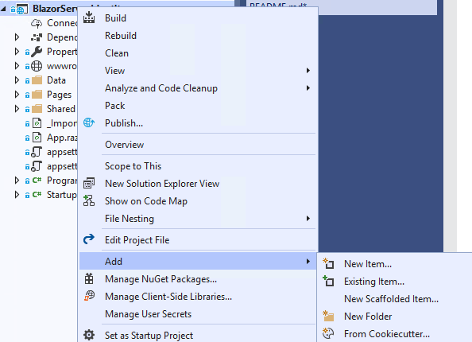
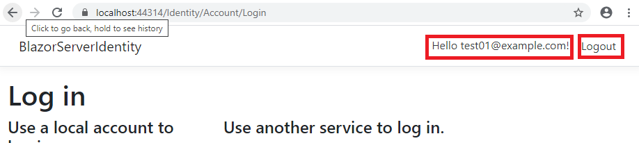

# BlazorServerIdentity
Project demonstrating scaffolding MS Identity into a Blazor Server project and converting the scaffolded pages to Blazor/Razor pages

## Base00.00.00
Base version
* Create a new Blazor Server project in Visual Studio
* Named this project BlazorServerIdentity

## Base 01.00.00
### Scaffold Identity  
* Right click on he project, Add --> New Item


* Select the Identity Scaffold


* The Identity Override Dialog will appear


* I have checked
    * Override all files
    * Click on the Plus symbol to create a new Data Context, accepted the default
    * Clicked the check box on using SQLite
    * Click the Plus symbol for a new User class, accepted the default
    
    * Click Add button to begin the scaffolding.  This will take a few minutes
     
    * When completed the Scaffolding ReadMe.txt file will appear.

### Edit Startup.cs
Use _Scaffolding Readme.txt_ as a guide.  It is not 100% accurate, but very close.
>
* This step is already done
> 
* Technically, this can go anywhere within ```Configure()``` but I put it below ```app.UseRouting();```
* I usually add ```app.UseAuthorization()``` and this **MUST** go below ```app.UseRouting();```
* This final product look like:
> 

 
> 
* This is no longer necessary with the introduction of ```services.AddRazorPages```
* See https://docs.microsoft.com/en-us/aspnet/core/migration/22-to-30?view=aspnetcore-3.1&tabs=visual-studio for further details
> 
* This is already done as shown above
>   
* Add these two in atop the ```MapBlazorHub``` and ```MapFallbackToPage("/_Host);``` entry generated during project creation.
* This is what the final product looks like:
* 

### New Files
* The Scaffolding process created approximately 72 files in Areas/Identity.
  * This is where Pages for Register, Login, and Logout are located.
* To support these Pages, the new files were created in folder <ProjectName>/Pages/Shared for Layout and Login menu items
* The files *_ViewImports.cshtml* and *_ViewStart.cshtml*  were added to support the Asp.Net core Pages
* Once converted to Blazor, all these files can go away.
* *ProjectName.db* is the SqLite db file.  
* _Scaffolding Readme.txt_ are the post scaffolding instructions.

### Modified Files
* *appsettings.json* -- SqLite connection string added to it.
  * Because of SqLite's embedded nature, nothing really sensitive in the connection string.  
  * Optional to keep in *appsettings.json* or put in **User Secrets** 
* *ProjectName.csproj* --  Scaffolding process downloaded and injects almost a dozen libraries into project.
* *Startup.cs* -- Manually modified.

### Compile Project
* Make sure the project compiles first.  The following steps won't work if it doesn't.
#### RegisterConfirmation.cshtml Error
* ```The type or namespace name 'UserManager<>' could not be found```
* This is a scaffolding errror, but easy to fix.
* Go to *ProjectName.Areas.Identity.Pages.Account*
* Open _RegisterConfirmation.cshtml.cs__
* Add ```using Microsoft.AspNetCore.Identity;``` top section of file
* Save and Compile
* Fix any additional errors.

### Database Setup
* Follow the instructions in _Scaffolding Readme.txt_
```
Type 'get-help NuGet' to see all available NuGet commands.

PM> Add-Migration CreateIdentitySchema
Build started...
Build succeeded.
To undo this action, use Remove-Migration.
PM> Update-Database
Build started...
Build succeeded.
Done.
PM> 
```

### Test
#### Registration Flow
* Launch the application
* The typical "Hello World" appears.
* Add ```Identity/Account/Login```  to the URL
* A screen like the following should appear
> * 
* Since no users exist in the database, you must first register one
* Select the **Register as a new user** link
> 
* Enter an account and password.  The Email address doesn't have to be real at this juncture.
* If successfully registered, a **Register Confirmation** screen will appear.  
> 

  * Because the system is not wired into an email system, confirmation step is a mock up.
    Click on the link to confirm the email address.
    * Internally, this updates the just registered account, setting ```IsEmailConfirmed = true```
    This is important because Authentication defaults to requiring confirmed email (which is also best practice).
    This and many other settings are adjustable in *Startup.cs* Authentication option *Need more here*
* After confirming the email, a findal **Confirm Email** screen appears.
> 
* This completes the Registration flow.  
* The pages used were *Register*, *RegisterConfirmation* and *ConfirmEmail*  These will be converted to Blazor.

#### Login / Logout Flow
* Click on the **Login** link highlighted in the picture above.
* Proceed to login with the email and password used earlier.
* You are returned to the *Hello World* page, with nothing new or different.
* Add ```Identity/Account/Login```  to the URL
* The page header should now be very different, with **Hello username** and **Logout** displayed
> 
* Clicking on **Hello username** will go to the Profile page, which is out of scope for this exercise.
* Clicking on **Logout** will logout the user.
> 
* This completes the Login / Logout flow
* The Login and Logout pages were used (duh)  This will also be modified for Blazor.
> Explore as you wish, and proceed when ready.


## Base 01.01.00

